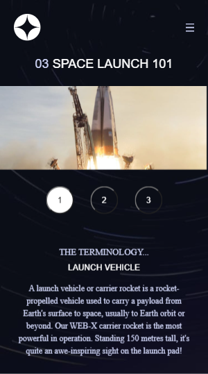
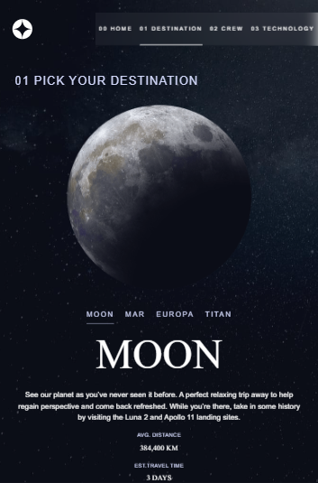
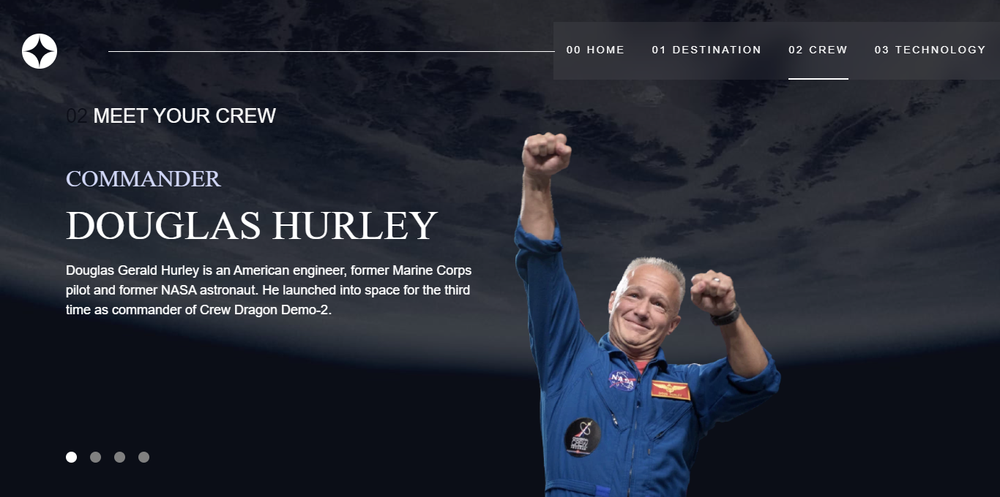

# Frontend Mentor - Space tourism website solution

This is a solution to the [Space tourism website challenge on Frontend Mentor](https://www.frontendmentor.io/challenges/space-tourism-multipage-website-gRWj1URZ3). Frontend Mentor challenges help you improve your coding skills by building realistic projects. 

## Table of contents

- [Overview](#overview)
  - [The challenge](#the-challenge)
  - [Screenshot](#screenshot)
  - [Links](#links)
- [My process](#my-process)
  - [Built with](#built-with)
  - [What I learned](#what-i-learned)
  - [Continued development](#continued-development)
  - [Useful resources](#useful-resources)
- [Author](#author)

## Overview

### The challenge

Users should be able to:

- View the optimal layout for each of the website's pages depending on their device's screen size
- See hover states for all interactive elements on the page
- View each page and be able to toggle between the tabs to see new information

### Screenshot

### Links

- Solution URL: [https://github.com/ibimina/space-tourism](https://github.com/ibimina/space-tourism)
- Live Site URL: [https://space-tourism-87d06.web.app/](https://space-tourism-87d06.web.app/)

## My process
I had to redo this project using firebase for backend development because I notice that in my last repository the page didn't render to the browser because I was fetching data from my browser local host
### Built with

- React
- Mobile-first workflow

## Author

Ibimina Hart
- Frontend Mentor - [@ibimina] (https://www.frontendmentor.io/profile/ibimina)
- Twitter - [@ibiminaaH] (https://www.twitter.com/profile/ibiminaaH)

